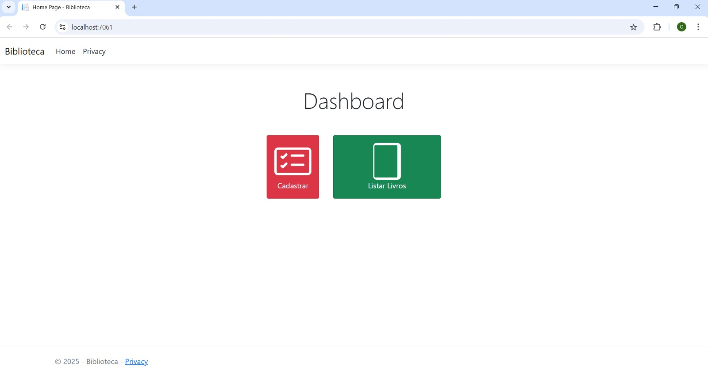
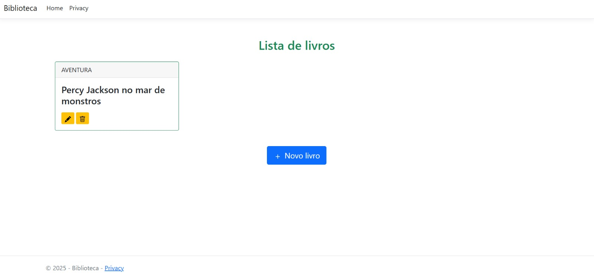
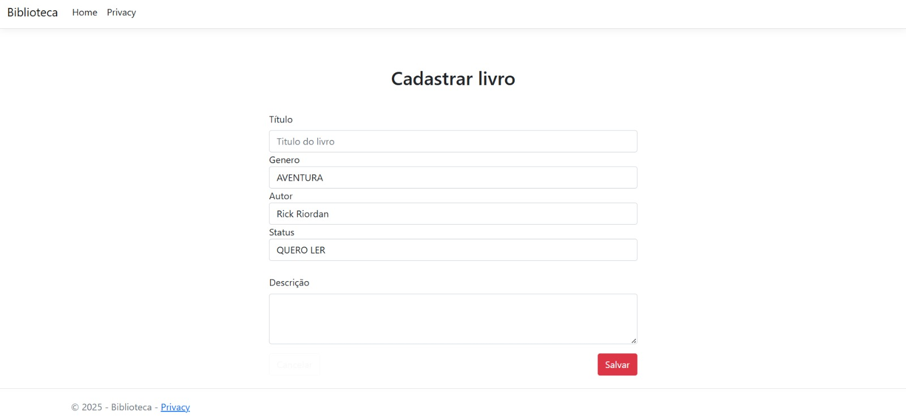
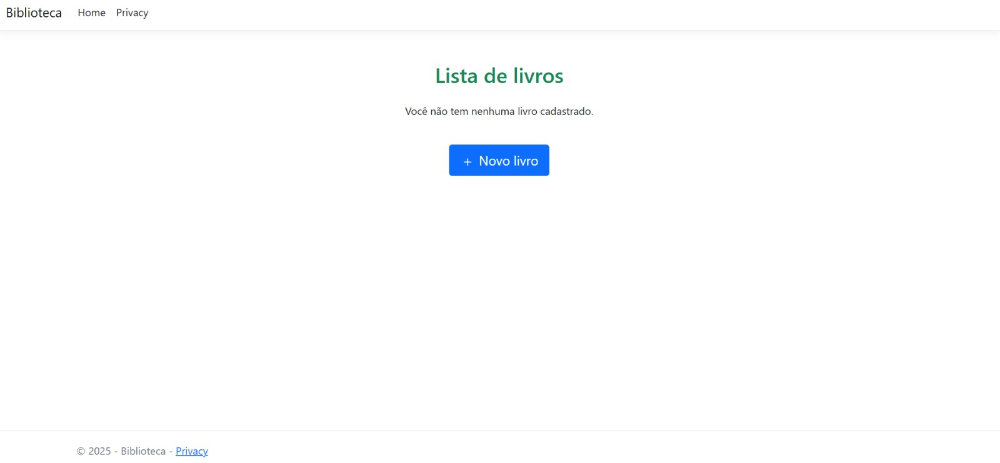
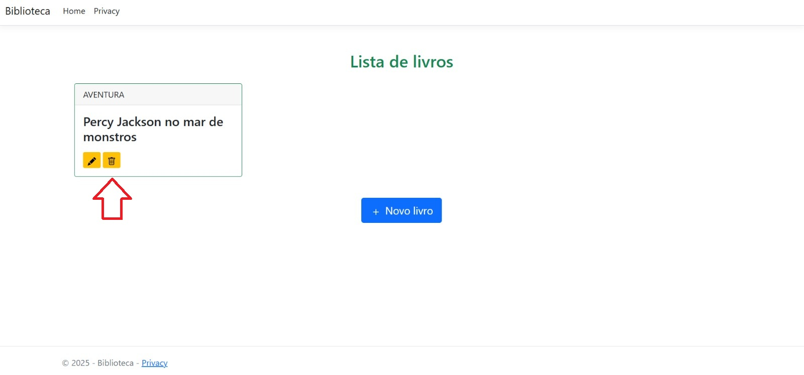
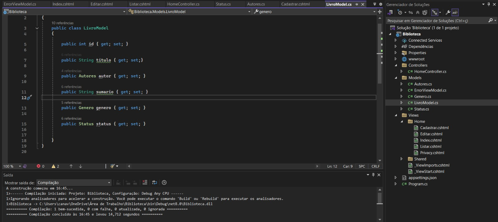

<h1 align="center">Biblioteca</h1>
</div>

<p align="center">
  <strong>Integrantes:</strong><br>
  RM557074 Guilherme Guimarães<br>
  RM555547 Matheus Oliveira de Luna<br>
  RM554507 Thiago Moreno Matheus<br>
  RM556118 Celso Canaveze Teixeira Pinto
</p>

## 📝 Sobre

O projeto **Biblioteca** é uma aplicação web desenvolvida em C# utilizando ASP.NET Core e Entity Framework Core. A aplicação permite gerenciar um catálogo de livros, oferecendo operações CRUD (Criar, Ler, Atualizar, Deletar) de forma simples e eficiente. O projeto inclui uma interface web intuitiva para que os usuários possam visualizar, adicionar, editar e excluir livros.

## ✨ Funcionalidades

- ✅ Listar livros cadastrados no sistema.
- ✅ Adicionar novo livro.
- ✅ Atualizar informações de livros existentes.
- ✅ Remover livros do sistema.

## 🚀 Tecnologias

As seguintes ferramentas foram utilizadas neste projeto:

- [ASP.NET Core 8.0](https://learn.microsoft.com/aspnet/core)
- [Entity Framework Core](https://learn.microsoft.com/ef/core)
- [Visual Studio](https://visualstudio.microsoft.com/)
- [SQL Server](https://www.microsoft.com/sql-server)

## ✔️ Requisitos

Antes de começar, certifique-se de ter [Git](https://git-scm.com), [Visual Studio](https://visualstudio.microsoft.com/) e o [.NET SDK 8.0](https://dotnet.microsoft.com/en-us/download/dotnet/8.0) instalados.

## 🏁 Começando

```bash
# Clone este projeto
$ git clone https://github.com/seuusuario/Biblioteca

# Acesse o diretório
$ cd Biblioteca

# Execute o projeto
$ dotnet run

# A aplicação estará disponível em http://localhost:5000
```

## 📁 Estrutura do Projeto

```
Biblioteca/
├── Controllers/            # Lógica de controle (HomeController.cs)
├── Models/                 # Modelos de dados (LivroModel, Autores, Genero, Status)
├── Views/                  # Páginas Razor (Index, Cadastrar, Editar, etc.)
│   ├── Home/
│   └── Shared/
├── wwwroot/                # Arquivos estáticos (CSS, JS, Bootstrap, jQuery)
├── appsettings.json        # Configurações da aplicação
├── Program.cs              # Inicialização da aplicação
├── Biblioteca.csproj       # Arquivo de projeto
└── Biblioteca.sln          # Solução do Visual Studio
```


## 🖥️ Interface da Aplicação

### Página Inicial



### Lista de Livros



### Cadastro de Livro



### Edição de Livro



### Confirmação de Exclusão



### Detalhes do Livro


### Visual Geral




## 🚀 Deploy

O projeto pode ser implantado no Azure App Service ou outro serviço de hospedagem compatível com ASP.NET.

---

